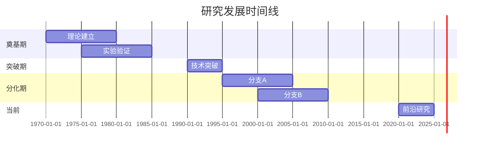
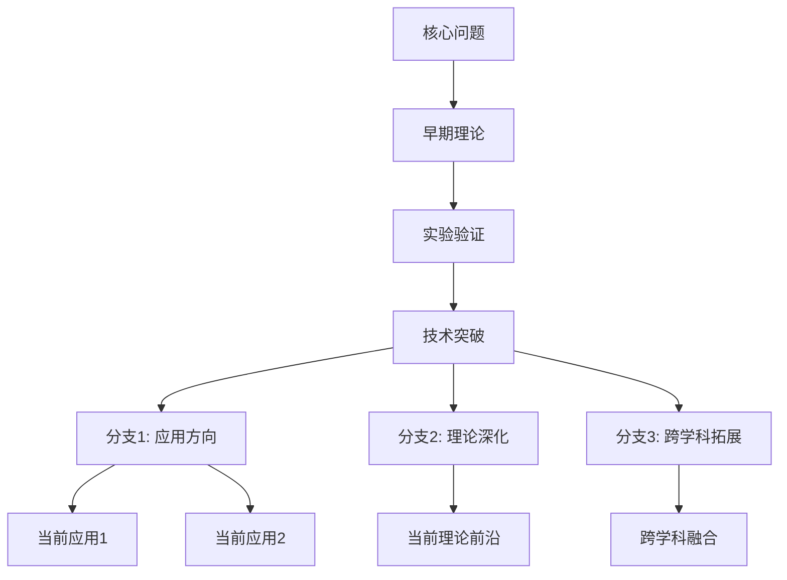
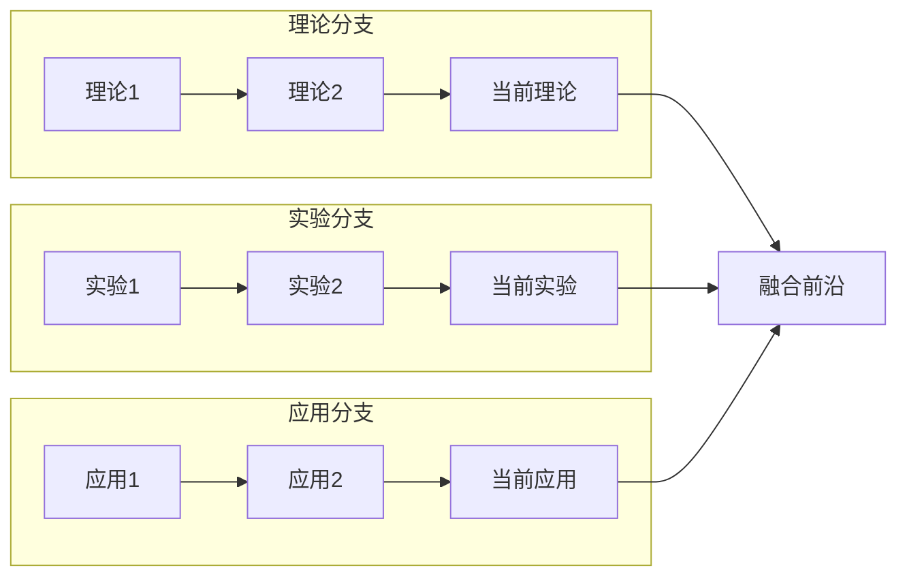
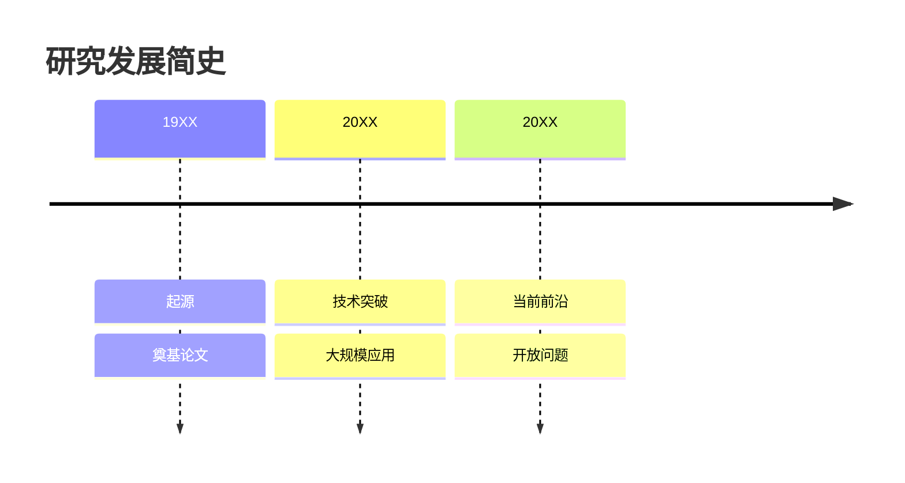

# Mermaid 图表模板参考

## 时间线（Gantt）

## 脉络图（Flow/Graph）

## 对比分支（Subgraph）

## 时间序列（Timeline，较新语法）

## 使用原则

1. **节点命名**：使用简短、准确的中文或英文术语
2. **连线标注**：在关键连线上添加说明文字，如 `--> |"关键转折"| B`
3. **颜色区分**：使用 subgraph 分组，区分不同分支或时期
4. **避免过度**：节点数量控制在 15 个以内，复杂脉络拆分成多个子图
