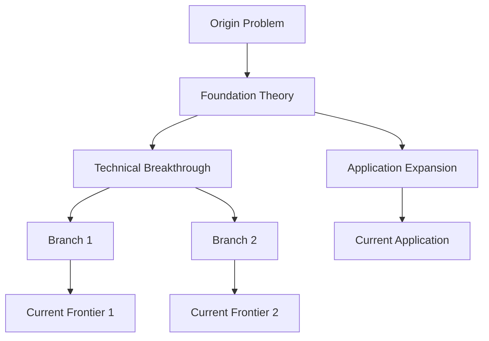

# Research Lineage — 研究脉络梳理

## Core Capability

Transform any user topic (phenomenon, concept, technology) into a structured research history
with timeline, key breakthroughs, research branches, and visual lineage maps.

## Workflow

### Phase 1: Topic Parsing & Search Strategy

User input may be:
- **Everyday phenomena**: "why is the sky blue", "why do people dream"
- **Scientific concepts**: "quantum entanglement", "CRISPR", "deep learning"
- **Technology/product**: "Transformer architecture", "blockchain technology"
- **Vague descriptions**: natural language descriptions of a phenomenon

**Step 1**: Convert user input into precise academic search keywords. Construct search terms
in both English and Chinese, covering terminology, related concepts, key figures, etc.

**Search Priority**:
1. Academic reviews (review/survey) → Quick global understanding
2. Milestone papers (landmark events, highly cited) → Anchor key nodes
3. Frontier research (recent papers) → Fill in latest progress
4. Chinese literature (for China-related research or Chinese users) → Local perspective

### Phase 2: Information Collection

Use multiple tools in rounds, calling by priority and scenario:

#### Tool Matrix

| Tool | Scenario | Advantage | Call Method |
|------|----------|-----------|-------------|
| `web_search` | Quick overview, reviews, milestones, timelines | Broad coverage, fast response | Direct call |
| `academic_search` (arXiv) | English preprints, CS/physics/math frontiers | Precise metadata, PDF links | Direct API call |
| `academic_search` (scholar) | Google Scholar indexed, citation counts, PDFs | High citations, broad coverage | Direct API call |
| `browser_automation` (CNKI) | Chinese CSSCI journals, citation sorting, export | Chinese local perspective, batch export | Browser automation |
| `web_fetch` | Direct visits to Semantic Scholar, CrossRef, PubMed | Precise abstracts, DOIs | URL fetch |

#### Joint Retrieval Strategy

```
Rounds 1-2 (Overview + Milestones):
  - Main: web_search
  - Parallel: try academic_search (arXiv/scholar) if topic is English frontier

Rounds 3-4 (Timeline + Frontiers):
  - Main: web_search
  - Cross-check: academic_search results vs web_search results
  - Supplement: web_fetch direct visits to Semantic Scholar for key paper abstracts

Round 5 (Chinese Literature Deep Search):
  - When topic involves Chinese research, policy, social phenomena, or user needs Chinese perspective
  - Via browser_automation on CNKI:
    1. Open https://kns.cnki.net/kns8s/AdvSearch
    2. Select "Academic Journals" → check "CSSCI"
    3. Input keywords (synonyms connected with +, groups with OR)
    4. Sort by citation count → 50/page → Abstract view
    5. Select all → "Export & Analysis" → "Novelty (Citation Format)" → Export Word
  - Keyword construction: Translate English topic to Chinese, expand synonyms/related terms

Round 6 (Supplementary Verification):
  - For unverified key papers, visit academic platforms directly for precise info
  - For CNKI-exported papers, extract bibliographic records for cross-checking
```

#### Pre-search Checks for Academic APIs

Before calling `academic_search`, ensure you know the available APIs:
- arXiv API: `http://export.arxiv.org/api/query?search_query=...`
- Semantic Scholar API: `https://api.semanticscholar.org/graph/v1/paper/search?query=...`
- Google Scholar: via `academic_search` provider or web_search fallback
- CrossRef API: `https://api.crossref.org/works?query=...`

```
Round 1: Topic overview
  - "[topic] review survey history"
  - "[topic] 研究进展 综述"

Round 2: Key milestones
  - "[topic] landmark paper breakthrough"
  - "[topic] 里程碑 关键发现"

Round 3: Timeline filling
  - "[topic] timeline evolution history"
  - Search specific year + topic to verify key events

Round 4 (Optional): Frontiers and branches
  - "[topic] recent advances 2024 2025"
  - "[topic] subtopics research directions"

Round 5: Chinese literature deep search (CNKI)
  - Applicable when topic involves Chinese research, policy, or social phenomena
  - Via browser_automation on CNKI:
    1. Open https://kns.cnki.net/kns8s/AdvSearch
    2. Select "Academic Journals" → check "CSSCI" source
    3. Keyword construction:
       - Translate English topic terms to Chinese
       - Expand synonyms/related terms with ` + ` connection
       - Multiple keyword groups with OR relationship
       - Example: "digital transformation" → `数字化转型 + 数字化变革 + 数字化`
    4. Sort by citation count → 50/page → Abstract view
    5. Select all → "Export & Analysis" → "Export" → "Novelty (Citation Format)"
    6. Download Word file with complete bibliographic records and abstracts
  - Include exported papers in lineage analysis as Chinese literature nodes

Round 6: Academic API deep search (arXiv + scholar)
  - Applicable when topic is English frontier (CS, physics, math, biology, etc.)
  - Call flow:
    1. `academic_search(provider="arxiv", query="[topic]", max_results=20)`
    2. Extract title, author, abstract, PDF link, publication date
    3. For high-relevance papers, use `web_fetch` to visit Semantic Scholar for citation count and DOI
    4. For Google Scholar: `academic_search(provider="scholar", query="[topic]", num_results=10)`
  - Cross-check results with web_search results, supplement missing milestone papers

Round 7 (Optional): Academic platform direct verification
  - For still-unverified key papers, visit directly:
    - Semantic Scholar: `https://api.semanticscholar.org/graph/v1/paper/search?query=...`
    - CrossRef: `https://api.crossref.org/works?query=...`
    - PubMed: `https://pubmed.ncbi.nlm.nih.gov/?term=...`
  - Use `web_fetch` to get page/JSON, extract precise metadata
```

### Search Precision Verification Mechanism

The core risk in research lineage tracing is **hallucination**: AI disguising memory fragments or speculation as verified academic facts. The following mechanisms forcibly intercept such risks.

#### 0. Verification Iron Law

> **"Difficult to verify" is not an acceptable conclusion.** Every key paper, year, author, and institution must reach `VERIFIED` or `NOT_FOUND` status. No gray zone.

#### 1. Five-Class Hallucination Detection List (Mandatory Scan)

Each literature citation and historical statement must actively check for these five patterns:

| Type | Code | Description | Detection Strategy |
|------|------|-------------|-------------------|
| **Totally Fabricated** | TF | Entire paper or key event doesn't exist | WebSearch title+author, no result = TF |
| **Pseudo-Authored** | PAC | Real scholar assigned non-existent paper | Check author's publication list via Google Scholar / Semantic Scholar |
| **Incomplete Info** | IH | Missing DOI, volume, page, or specific year | Mark as `[pending verification]`, additional search needed |
| **Patchwork Hoax** | PH | 2-3 real papers stitched into fake citation | Cross-check: title, author, journal, year must **all match one source** |
| **Subtle Distortion** | SH | Year, author abbreviation, journal slightly wrong | Field-by-field comparison with publisher/database records |

**Composite Deception Patterns (Special Attention)**:
- **Conference/Journal Exploitation**: Real journal name + fake paper details (common)
- **Time Masking**: Correct author + correct topic + wrong year
- **DOI Misleading**: Fake DOI pointing to unrelated real paper

#### 2. Literature Verification Process (Execute per item)

For **each key paper** in the output, while verifying, **must obtain its abstract**.

##### Abstract Acquisition Channels (by priority)

1. **Semantic Scholar API** — Query `abstract` field via `paperId` or `DOI` (most reliable)
2. **arXiv API** — For arXiv papers, via `http://export.arxiv.org/api/query?id_list=XXXX.XXXXX`
3. **Crossref API** — Query `abstract` field via DOI (partial publishers provide)
4. **WebSearch direct** — Search `"[paper title]" abstract` or visit publisher page
5. **Google Scholar page** — Last resort, extract from search result snippets
6. **CNKI export file** — For Chinese papers, browser automation exports Word with complete abstracts
7. **arXiv API** — Via `academic_search` to get metadata including abstract and PDF link
8. **Google Scholar API** — Via `academic_search` to get citation count, year, journal, link
9. **Academic platform direct** — Use `web_fetch` to visit Semantic Scholar, CrossRef, PubMed for precise abstracts and DOIs

**Abstract acquisition failure handling**:
- If unable to obtain abstract → Mark `[abstract not obtained]`, but keep paper (if verification passed)
- If abstract obtained but non-English (e.g., Chinese paper) → Output original text, no translation needed

##### Verification Steps (A→B→C→D)

**Step A: Semantic Scholar API Quick Screening**
- Batch query author+title combinations, get `abstract` field simultaneously
- If returns `S2_VERIFIED` → Proceed to Step B for detail check
- If `S2_NOT_FOUND` → Proceed to Step C WebSearch deep verification
- If `API_UNAVAILABLE` → Directly proceed to Step C

**Step B: Bibliographic Detail Cross-Check**
- Confirm author, title, year, journal/conference name **all consistent**
- Check if DOI exists and is resolvable
- Check if page/volume matches publisher records
- Check if abstract matches publisher page

**Step C: WebSearch Item-by-Item Verification (when API unavailable)**
- Search at least 3 times with different keyword combinations:
  - `[author name] [title keyword] [year]`
  - `[title] DOI`
  - `[author] [journal name] [year]`
- No clear result after 3 searches → Mark `NOT_FOUND`
- Any search returns clear result → Record source URL, mark `VERIFIED`
- Simultaneously try to get abstract from search results or publisher pages

**Step D: Timeline Consistency Verification**
- Check if paper publication year is earlier than papers citing it
- Check if "foundation period" papers are earlier than "breakthrough period" papers
- Check if technology appearance time is earlier than claimed application time
- If timeline paradox found → Mark `[timeline pending verification]`

**Step E: Data Source API and Multi-Source Cross Verification**
- For arXiv papers: Query via `academic_search`, confirm title, authors, abstract, published consistent
- For Google Scholar results: Get via `academic_search`, confirm citation count, year, journal match
- For CNKI exported papers: Extract bibliographic info from export file, confirm author, title, journal, abstract, year consistent
- For Semantic Scholar direct visit results: Check paperId, DOI, citation count
- If data source results differ from WebSearch results → Mark `[data source inconsistency]` and further verify via `web_fetch` direct publisher page visit
- If CNKI results differ from English database results (same author/topic) → List separately, mark `[Chinese/English source difference]`

#### 3. Literature Translation Requirements

For each verified key paper, **must provide**:
- **Title Chinese translation**: Accurate, academic, maintaining original academic tone
- **Abstract Chinese translation**: Complete translation, no omission of technical details, data, conclusions

**Translation Standards**:
- Human names, institution names, technical terms keep original or note original in parentheses at first occurrence
- Mathematical formulas, chemical formulas, algorithm names keep original
- Do not add interpretations or comments not in original — translation only conveys information
- If original has polysemy or translation ambiguity, choose the most discipline-appropriate translation

#### 4. Research History Verification (Non-Literature Statements)

For non-citation factual statements (e.g., "Institution X first proposed concept Y in year Z"):

- Search `[institution/person] [event] [year]` to confirm
- Search `[topic] history timeline` for cross-check
- If multiple sources give different years → Mark `[year disputed: source A says XX, source B says YY]`
- If single source cannot verify → Mark `[pending verification]`

#### 5. Traceability Annotation Standards

All verified information must be annotated with credibility in output:

| Annotation | Meaning | Usage Condition |
|-----------|---------|----------------|
| No annotation | Verified, reliable source | Confirmed via WebSearch/API, authoritative source |
| `[pending verification]` | Limited sources, cannot confirm | Search didn't return clear results, but mentioned by user/other sources |
| `[limited sources]` | Scarce search results, possible omission | Niche topic, not yet covered by authoritative reviews |
| `[disputed]` | Multiple sources contradict | Year, priority, authorship has academic disputes |
| `[speculation]` | Reasonable inference based on existing info | Explicitly stated as inference, not verified fact |

#### 6. Anti-Source Hallucination Strategy

> **Core Risk**: AI "memory" may mistake common collocations in training data as real citations. Cannot judge citation authenticity by feeling.

- **Must WebSearch**: Cannot skip search because "this paper is famous"
- **Cross-verification**: Same key event confirmed by at least 2 independent sources
- **Default Skepticism**: Maintain skepticism toward any unsearched citation until verified
- **Special Alert**: Classic/milestone papers are most easily hallucinated — because "everyone knows this paper exists", hallucination more easily passes intuition check

#### 7. Verification Result Recording

In skill output, after "References" section append:

```markdown
## Verification Record

| Verification Item | Status | Method | Notes |
|-------------------|--------|--------|-------|
| Smith et al. (2020) | ✅ VERIFIED | Semantic Scholar + WebSearch | DOI: 10.xxxx/xxxxx |
| Jones (2018) first proposed X | ⚠️ Partially verified | WebSearch 2 confirmations | Source A says 2018, Source B says 2019 |
| Zhang (2022) key breakthrough | ❌ NOT_FOUND | WebSearch 3 times no result | Possible hallucination, removed |
| Institution launched project in 2015 | ✅ VERIFIED | Official website + news | Multiple sources cross-confirmed |
```

**Items failing verification**:
- If core paper/event → Remove from output, inform user of removal reason
- If secondary info → Keep but mark `[pending verification]`, explain risk

### Lineage Organization

Extract research lineage structure from collected information:

**Time Dimension**:
- Origin period (Who first proposed? What problem inspired this direction?)
- Foundation period (Key theory/experiment established, which papers are must-read?)
- Explosion period (Technical breakthrough, application landing, what caused research surge?)
- Differentiation period (Different branch directions emerged, what are main schools?)
- Current period (Latest progress, open questions, controversies)

**Thematic Branch Dimension**:
- By research methodology (theory/experiment/computation/engineering)
- By application domain (medicine/physics/society/industry)
- By technical route (different algorithm architectures, different experimental paradigms)

**Key Node Identification**:
- Milestone papers (author, year, core contribution, one-sentence summary)
- Technical turning points (What discovery changed direction?)
- Controversies and corrections (Which hypotheses were overturned? Which schools are debating?)

### Bibliometric Analysis

Perform following analysis on collected literature to deepen lineage understanding:

#### 1. Impact Analysis

For each key paper, calculate/extract:
- **Citation count**: Total citations (from Semantic Scholar, Google Scholar, CNKI)
- **h-index**: Author/team's h-index (from Google Scholar or academic platforms)
- **Citation growth rate**: 3-year citation growth trend ("classic" vs "hot")
- **Domain influence**: Proportion of top-tier journal/conference citations

**Data Sources**:
- `academic_search` (scholar) → Get citation_count
- `web_fetch` visit Semantic Scholar page → Get citation count and citing paper list
- CNKI export file → Get citation count (CSSCI source)

**Annotation Standards**:
- 🔥 Highly cited: Total > 1000 (field-specific) or top 5%
- ⭐ Breakthrough: > 50%/year citation growth in last 3 years
- 📉 Declining: Citation decreasing in last 3 years
- 🆕 Emerging: Published < 3 years, citation rapidly growing

#### 2. Co-citation Network Analysis

Identify which papers are co-cited by the same batch — these constitute the "knowledge base" of the field.

**Analysis Method** (referencing VOSviewer clustering visualization):
1. Extract reference lists from each paper (preferably via Semantic Scholar API)
2. Count co-occurrence frequency of references
3. Build co-citation matrix: How many papers co-cite paper A and paper B?
4. **Cluster identification**: High-frequency co-cited papers = core theory/method clusters
5. **Network visualization description**: Textually describe co-citation network structure (central nodes, connection strength, cluster boundaries)

**Cluster Quality Assessment** (referencing CiteSpace metrics):
- **Modularity Q-score**: Separation between clusters
  - Q > 0.3: Cluster structure significant
  - Q > 0.5: Cluster structure clear
  - Q < 0.3: Cluster boundaries fuzzy, re-analysis needed
- **Silhouette S-score**: Internal cluster consistency
  - S > 0.7: Papers within cluster highly consistent, credible
  - S = 1.0: Cluster relatively isolated, may be independent direction
  - S < 0.5: High heterogeneity within cluster, needs splitting

**LLR Algorithm Cluster Label Extraction**:
- For each co-citation cluster, extract representative keywords
- Use Log-Likelihood Ratio algorithm to extract most representative terms from cluster paper titles/abstracts/keywords
- Cluster label = core theme of that research direction

**Output Format**:
```
Knowledge Base (Co-citation Core):
┌─ Cluster 1 [Label: Deep Learning Foundation Theory] (Q=0.52, S=0.81)
│   ├─ [Paper A] (betweenness centrality=0.35, purple ring marker) ── CNN Architecture
│   ├─ [Paper B] (cited by 65%) ── Backpropagation Algorithm
│   └─ [Paper C] (cited by 50%) ── Gradient Descent Optimization
├─ Cluster 2 [Label: Computer Vision Applications] (Q=0.48, S=0.75)
│   ├─ [Paper D] (betweenness centrality=0.28) ── Image Classification
│   └─ [Paper E] (cited by 40%) ── Object Detection
└─ Cluster 3 [Label: Natural Language Processing] (Q=0.41, S=0.72)
    ├─ [Paper F] ── Word Embeddings
    └─ [Paper G] ── Transformer Architecture
```

**Key Node Identification** (referencing CiteSpace betweenness centrality):
- **High betweenness centrality nodes** (purple ring marker): "Bridge papers" connecting multiple clusters, key cross-disciplinary/cross-direction literature
- **High citation nodes** (large nodes): Core foundational literature within cluster
- **Burst nodes** (red ring/high brightness): Recently surging emerging literature

#### 3. Citation Burst Detection

Identify papers experiencing sudden citation growth — usually marking important turning points or breakthroughs.

**Detection Method** (referencing CiteSpace burst detection):
1. Get annual citation data (from Semantic Scholar or Google Scholar trends)
2. Use Kleinberg (2002) burst detection or time series anomaly detection:
   - Calculate sudden changes in citation intensity (not simple growth rate)
   - Identify "burst start year" and "burst end year"
   - Calculate Burst Strength = average citation increment during burst period
3. Burst Strength > threshold (field-dependent, usually > 3.0) → Mark as "citation burst"

**CiteSpace-style Output**:
```markdown
## Citation Burst Papers (Top 10)

| Paper | Burst Start | Burst End | Burst Strength | Possible Cause |
|-------|------------|-----------|---------------|----------------|
| GPT-4 Technical Report (2023) | 2023 | 2024 | 18.52 | 🔥🔥🔥 Large model capability breakthrough |
| Attention Is All You Need (2017) | 2018 | 2021 | 15.33 | 🔥🔥🔥 Transformer architecture revolution |
| ... | ... | ... | ... | ... |

**Burst Pattern Interpretation**:
- Sustained burst (2+ years): Foundational breakthrough, long-term impact
- Short burst (1 year): Hot topic, may fade quickly
- Post-burst sustained high citation: Converted to field foundation
- Post-burst rapid decline: Hyped topic, limited actual value
```

#### 4. Research Frontier Detection

Identify which topics are rapidly emerging and which are declining.

**Keyword Analysis**:
1. Extract keywords/themes from search results (via paper title+abstract NLP analysis)
2. Count keyword occurrence frequency by year
3. Calculate keyword growth rate: `frequency last 3 years / frequency previous 3 years`

**Frontier Indicators**:
- 🔥 Burst keyword: Growth rate > 3x, > 10 occurrences in last 3 years
- 📈 Rising keyword: Growth rate 1.5x-3x
- 📊 Stable keyword: Growth rate 0.8x-1.5x
- 📉 Declining keyword: Growth rate < 0.8x

#### 5. Research Gap Identification

Analyze coverage of existing literature to identify under-researched directions.

**Method** (referencing VOSviewer keyword co-occurrence + CiteSpace structural variation):
1. Build keyword co-occurrence matrix: Which keywords frequently co-occur?
2. Identify "isolated keywords": Highly related but rarely co-studied topic combinations
3. Compare "hot combinations" vs "cold combinations"
4. **Structural Variation Analysis** (referencing CiteSpace):
   - Identify "new connections": Which papers first connected two originally separate directions?
   - These "bridge papers" often mark new frontiers or paradigm shifts
   - Quantify "interdisciplinary connection potential": Number of novel citation connections established

#### 6. Interdisciplinary Mapping

Identify citation relationships between this field and other disciplines.

**Method**:
1. Count cross-disciplinary citation proportions from citing paper lists
2. Identify "bridge papers": Papers co-cited by multiple disciplines (high betweenness centrality)
3. Draw interdisciplinary knowledge flow map

#### 7. Timeline Analysis

Reference CiteSpace timeline view, unfold research themes along time axis.

#### 8. Journal Dual-map Overlay

Reference CiteSpace dual-map overlay, analyze "where knowledge comes from, where it goes".

#### 9. Cluster Evolution Analysis

Track evolution, split, and merge of research directions (clusters).

### Output Construction

Before constructing final output, must complete above **precision verification mechanism**. Only verified information enters final output. Unverified info either deleted or marked `[pending verification]` or `[limited sources]`.

**Use following Markdown structure uniformly**:

```markdown
# [Topic] Research Lineage

## Overview

[2-3 sentences summarizing the research landscape: when it started, core questions, current state]

## Research Timeline

```mermaid
gantt
    title [Topic] Research Development Timeline
    dateFormat YYYY
    section Foundation
    Foundation Event 1 : 19XX, 19XX
    Foundation Event 2 : 19XX, 19XX
    section Breakthrough
    Key Breakthrough : 19XX, 19XX
    section Differentiation
    Branch A Rise : 19XX, 19XX
    Branch B Rise : 19XX, 19XX
    section Current
    Frontier Progress : 20XX, 20XX
```

> **Note**: If Mermaid rendering not supported, ASCII timeline provided below.

### ASCII Timeline

```
19XX ────── 19XX ────── 20XX ────── 20XX ────── 20XX
  │            │            │            │            │
  ▼            ▼            ▼            ▼            ▼
Foundation  Breakthrough  Branch Split  Tech Burst   Current Frontier
```

## Key Milestones

| Year | Researcher/Institution | Contribution | Impact |
|------|----------------------|--------------|--------|
| 19XX | Name/Institution | One-sentence core contribution | Laid theoretical foundation / Opened new direction / ... |
| ... | ... | ... | ... |

## Research Direction Branches

### Branch 1: Direction Name

- **Core Question**: ...
- **Representative Methods**: ...
- **Key Literature**: Year - Author - Paper Title (brief note)
- **Current State**: ...

### Branch 2: Direction Name

...

## Research Lineage Visualization



## Key Literature Index & Abstracts

### Paper 1

**Original Info**
- Author. (Year). *Title in Original Language*. *Journal/Conference*. [DOI/Link]
- **Original Abstract**:
  > [Abstract text in original language]

**Chinese Translation**
- **Title**: [Translated title]
- **Abstract**:
  > [Translated abstract]

**Verification Status**: ✅ VERIFIED / ⚠️ Partially verified / ❌ NOT_FOUND
**Verification Notes**: [Method, DOI, source URL, etc.]

---

### Paper 2

... (same format)

---

## Current Open Questions

- [ ] Question 1...
- [ ] Question 2...

## Research Gaps & Opportunities

| Gap Area | Under-researched Topic Combinations | Potential Value | Suggested Entry Point |
|----------|-----------------------------------|----------------|----------------------|
| | | | |

## Interdisciplinary Connections

This field has knowledge flow with:

- [Discipline A] ← [Bridge Paper] → [Discipline B]
- ...

## Bibliometric Summary

| Metric | Value | Notes |
|--------|-------|-------|
| Total papers included | XX | Papers passing screening |
| Highly cited (>1000) | XX | Marked 🔥 |
| Citation burst papers (last 3 years) | XX | Marked ⭐ |
| Cross-disciplinary bridge papers | XX | Cited by ≥2 disciplines |
| Chinese literature proportion | XX% | CNKI/CSSCI source |
| English literature proportion | XX% | arXiv/Scholar/Semantic source |

### Citation Burst Papers

| Paper | Burst Year | Burst Strength | Possible Cause |
|-------|-----------|---------------|----------------|
| | | | |

### Research Frontier Keywords

#### Emerging Directions (Burst Keywords)
- 

#### Rising Directions
- 

#### Declining Directions
- 

## Literature Screening Record (PRISMA-style)

### Search Strategy
- Search time: [YYYY-MM-DD HH:MM]
- Search tools: web_search, arXiv API, Google Scholar API, CNKI Advanced Search
- Search keywords: [List all keyword combinations used]
- Language limit: Chinese/English (if applicable)
- Time limit: [e.g., 2000-2025]

### Screening Flow
| Stage | Source | Initial Results | After Deduplication | Excluded (Irrelevant) | Excluded (Unavailable) | Included |
|-------|--------|----------------|--------------------|----------------------|------------------------|----------|
| Overview Search | web_search | XX | XX | XX | XX | XX |
| English Deep | arXiv + Scholar | XX | XX | XX | XX | XX |
| Chinese Deep | CNKI CSSCI | XX | XX | XX | XX | XX |
| **Total** | | **XX** | **XX** | **XX** | **XX** | **XX** |

### Exclusion Reason Details
- Duplicate papers: XX (list)
- Irrelevant topic: XX (keyword mismatch)
- Full text unavailable: XX (only title/abstract, no DOI/link)
- Non-peer-reviewed: XX (source unverifiable)

## Verification Record

| Verification Item | Status | Method | Notes |
|-------------------|--------|--------|-------|
| | | | |

## References

- Source 1 (Database/Platform name, search time)
- Source 2 (...)
```

**Output Standards**:
- Timeline precise to year, key events to month or date
- Each milestone with one-sentence contribution note
- Literature citation format unified: Author. (Year). Title. Journal/Conference.
- If insufficient info, mark `[pending verification]` or `[limited sources]`, do not fabricate
- Chinese and English literature treated equally, listed separately
- Visualization based on real梳理 results, no fabricated branch relationships
- **All key papers must be verified via WebSearch/API, unverified ones don't enter output**
- **Timeline must be cross-verified, mark `[timeline pending verification]` when paradox found**

## Quality Checklist

Before output, self-check:
- [ ] Timeline has at least 5 key nodes?
- [ ] Branch division covers main research directions?
- [ ] **Completed "Five-Class Hallucination Detection"? Every paper checked for TF/PAC/IH/PH/SH?**
- [ ] **Completed "Literature Verification Process" (A→B→C→D→E)? Every key paper reached VERIFIED or NOT_FOUND?**
- [ ] **Completed "Timeline Consistency Verification"? No time paradoxes found?**
- [ ] Distinguish "verified facts" from "speculation/inference"?
- [ ] **Abstract obtained for every key paper?** (Failed marked `[abstract not obtained]`)
- [ ] **Chinese translation provided for every paper title?** (Accurate, academic)
- [ ] **Chinese translation provided for every paper abstract?** (Complete, no omission of technical details)
- [ ] **Translation faithful to original?** (No added interpretations or comments)
- [ ] Information sources and search time annotated?
- [ ] **"Verification Record" table appended?**
- [ ] **Bibliometric analysis executed?** (Impact, co-citation, citation burst, frontier detection)
- [ ] **Research gaps identified?** (Keyword co-occurrence analysis, cold combinations)
- [ ] **Interdisciplinary connection map drawn?** (Cross-disciplinary citations, bridge papers)
- [ ] Obvious omission directions (cross-verified via multi-angle search)?
- [ ] **Output includes PRISMA-style screening record?** (Search→Screen→Include, exclusion reasons)

## Limitations & Notes

- Search depth limited by available tool capabilities, complex topics may need multi-round iteration
- Latest research (last 6 months) may not yet be covered by reviews, need direct paper search
- For very new or extremely niche topics, may not form complete lineage, inform user
- Chinese literature search may have coverage gaps, **CNKI advanced search automation can greatly supplement CSSCI journal coverage**, but user may supplement with Wanfang queries
- When search results insufficient, actively state "currently available literature is limited" rather than force fabrication
- **Precision verification mechanism may increase output time, but cannot be skipped. Prefer sparse but reliable info over dense but unverifiable info**
- **Classic/milestone papers most easily hallucinated — don't skip WebSearch verification because "this paper is famous"**
- **CNKI Advanced Search Automation**: Applicable for batch retrieval of Chinese CSSCI journal bibliographic records and abstracts. Use `browser_automation` tool, following CNKI skill flow. May encounter CAPTCHA requiring manual completion.
- **Academic API Calls**: arXiv and Scholar suitable for English literature deep search, can get precise metadata and PDF download links.
- **Multi-tool Joint Retrieval Strategy**: For complex topics, first use `web_search` to establish global understanding (Rounds 1-2), then use `academic_search` and CNKI to supplement deep literature (Rounds 5-6), finally use `web_fetch` academic platform to verify key papers (Round 7).
- **Tool Call Order**: Don't call all tools at once. Proceed round by round, previous round results guide subsequent retrieval strategy.
