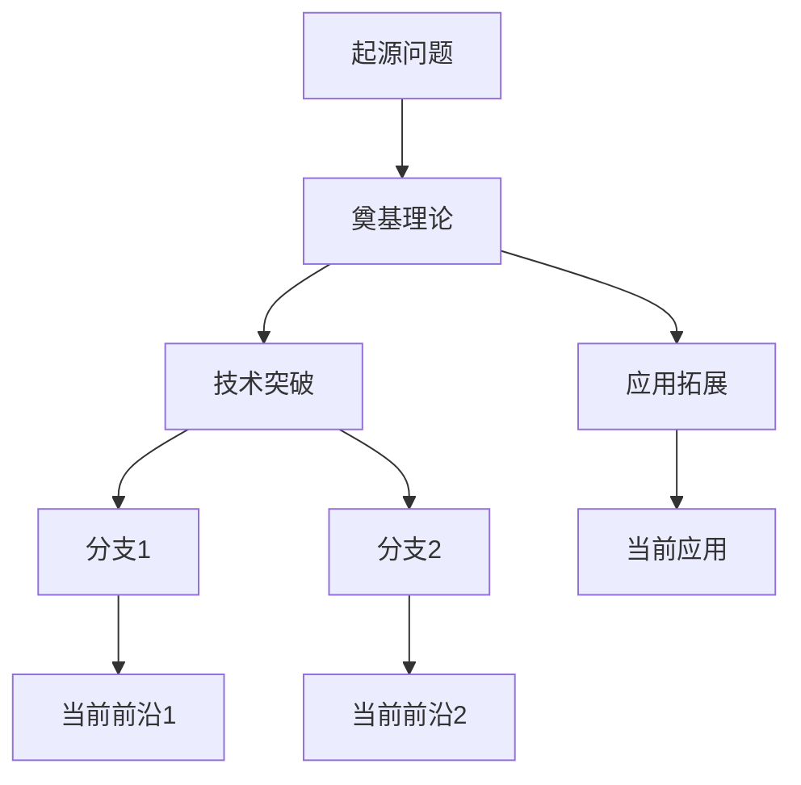

# Research Lineage — 研究脉络梳理

## 核心能力

将用户输入的任意主题（现象、概念、技术）转化为结构化的研究历史梳理，
包含时间线、关键突破、研究方向分支和可视化脉络图。

## 工作流程

### 1. 主题解析与搜索策略

用户输入可能是：
- **日常现象**："为什么天空是蓝色的"、"人为什么会做梦"
- **科学概念**："量子纠缠"、"CRISPR"、"深度学习"
- **技术/产品**："Transformer架构"、"区块链技术"
- **模糊描述**：一段自然语言描述某个现象

**第一步**：将用户输入转化为精准的学术搜索关键词。用英文和中文分别构造搜索词，
覆盖术语、相关概念、关键人物等维度。

**搜索优先级**：
1. 学术综述（review/survey）→ 快速建立全局认知
2. 里程碑论文（里程碑事件、高引文献）→ 锚定关键节点
3. 前沿研究（recent papers）→ 补全最新进展
4. 中文文献（针对中国相关研究或中文用户）→ 补充本土视角

### 2. 信息收集

使用多工具联合执行多轮搜索，按优先级与场景调用：

### 工具矩阵

| 工具 | 适用场景 | 优势 | 调用方式 |
|------|---------|------|---------|
| `kimi_search` | 快速概览、综述、里程碑、时间线 | 覆盖广、响应快 | 直接调用 |
| `kimi_datasource_call` (arXiv) | 英文预印本、CS/物理/数学前沿 | 元数据精确、含PDF链接 | 先 `kimi_datasource_get_desc` 获取API，再调用 |
| `kimi_datasource_call` (scholar) | Google Scholar 索引、引用数、PDF | 引用量高、覆盖广 | 同上 |
| `browser` (知网自动化) | 中文CSSCI期刊、被引排序、题录导出 | 中文本土视角、可批量导出 | 按 `cnki-advanced-search` 技能流程执行 |
| `kimi_fetch` / `web_fetch` | 直访 Semantic Scholar、CrossRef、PubMed 页面 | 获取精确摘要、DOI | 传入论文URL |

### 联合检索策略

```
第1-2轮（概览+里程碑）：
  - 主力：kimi_search
  - 同步：尝试 arXiv/scholar 数据检索（如果主题为英文前沿领域）

第3-4轮（时间线+前沿）：
  - 主力：kimi_search
  - 交叉验证：arXiv/scholar 结果与 kimi_search 对比
  - 补充：对关键论文用 kimi_fetch 直访 Semantic Scholar 页面获取摘要

第5轮（中文文献深度检索）：
  - 当主题涉及中国研究、中文用户、或需要本土视角时
  - 通过 browser 在知网执行：
    1. 打开 https://kns.cnki.net/kns8s/AdvSearch
    2. 选择"学术期刊" → 勾选"CSSCI"
    3. 输入关键词（同义词用 + 连接，多组用 OR）
    4. 按被引量排序 → 50条/页 → 摘要视图
    5. 全选 → "导出与分析" → "查新（引文格式）" → 导出 Word
  - 关键词构造：英文主题词翻译为中文，扩展同义词/同位词

第6轮（补充验证）：
  - 对未通过验证的关键文献，用学术平台直访获取精确信息
  - 对知网导出的文献，提取题录进行交叉验证
```

### 数据源调用前置检查

调用 `kimi_datasource_call` 前，必须先执行：
```
kimi_datasource_get_desc(data_source_name="arxiv")  # 获取 arXiv API 参数
kimi_datasource_get_desc(data_source_name="scholar")  # 获取 scholar API 参数
```
然后根据返回的 API 说明，构造 `kimi_datasource_call` 参数。

```
第1轮：主题 overview
  - "[主题] review survey history"
  - "[主题] 研究进展 综述"

第2轮：关键里程碑
  - "[主题] landmark paper breakthrough"
  - "[主题] 里程碑 关键发现"

第3轮：时间线填充
  - "[主题] timeline evolution history"
  - 搜索具体年份 + 主题，验证关键事件

第4轮（可选）：前沿与分支
  - "[主题] recent advances 2024 2025"
  - "[主题] subtopics research directions"

第5轮：中文文献深度检索（CNKI）
  - 适用条件：主题涉及中国研究、政策、社会现象，或用户明确需要中文视角
  - 检索流程（按 `cnki-advanced-search` 技能执行）：
    1. 用 browser 打开 https://kns.cnki.net/kns8s/AdvSearch
    2. 选择"学术期刊" → 勾选"CSSCI"来源
    3. 关键词构造：
       - 将英文主题词翻译为中文
       - 扩展同义词/同位词，用 ` + ` 连接
       - 多组关键词用 OR 关系
       - 例："数字化转型" → `数字化转型 + 数字化变革 + 数字化`
    4. 按被引量排序 → 切换 50条/页 → 打开摘要视图
    5. 全选当前页 → "导出与分析" → "导出文献" → "查新（引文格式）"
    6. 下载 Word 文件，包含完整题录和摘要
  - 将导出文献纳入脉络梳理，作为中文文献节点

第6轮：学术数据源深度检索（arXiv + scholar）
  - 适用条件：主题偏向英文前沿领域（CS、物理、数学、生物等）
  - 调用流程：
    1. `kimi_datasource_get_desc("arxiv")` → 获取可用API
    2. `kimi_datasource_call(data_source_name="arxiv", api_name="search", params={"query": "[主题]", "max_results": 20})`
    3. 提取标题、作者、摘要、PDF链接、发表日期
    4. 对高相关论文，用 `kimi_fetch` 访问 Semantic Scholar 页面获取引用数和DOI
    5. 对 Google Scholar：`kimi_datasource_get_desc("scholar")` → 获取API → 调用搜索
  - 将检索结果与 kimi_search 结果交叉验证，补充遗漏的里程碑论文

第7轮（可选）：学术平台直访验证
  - 对仍未通过验证的关键文献，直接访问：
    - Semantic Scholar：`https://api.semanticscholar.org/graph/v1/paper/search?query=...`
    - CrossRef：`https://api.crossref.org/works?query=...`
    - PubMed：`https://pubmed.ncbi.nlm.nih.gov/?term=...`
  - 用 `kimi_fetch` 或 `web_fetch` 获取页面/JSON，提取精确元数据
```

## 零误引 Chain-of-Evidence (CoE) 引用架构

> **核心原则**："Every claim must be traceable, through a recorded chain of supporting claims and evidence, to a grounding source." 引用验证不是"事后检查"，而是系统设计的架构属性。

### 1. 引用图构建（Citation Graph）——从种子文献出发

**传统失败模式**：逐个搜索验证，容易遗漏，且无法识别文献间的真实引用关系。

**ScientistOne 架构**：

```
种子文献（2-4篇）
    ↓
Semantic Scholar API 遍历参考文献+引用关系（最多2跳深度）
    ↓
生成约 2,000-5,000 篇候选论文的引文图
    ↓
LLM 双层评分：方法相关性 + 问题对齐度（各1-5分）
    ↓
精英池（elite pool）：Core（≥4分）+ Adjacent（≥3分）≈ 500篇
    ↓
主题相关性门控：Core+Adjacent < 5篇 → 终止流程，防止下游漂移
    ↓
多轮调查：Librarian 选文献 → 5个 Researcher 并行读全文 → 结构化简报
    ↓
种子参考文献书目（seed reference bibliography）
```

**关键保障**：
- **所有引用必须来自 API 检索结果**，而非模型参数记忆
- **每篇论文必须记录来源元数据**（provenance metadata）：检索工具、检索时间、API 返回记录、缓存路径
- **缓存 API 结果**：证据链中缓存每个 API 调用结果，确保可追溯

> **警告**：没有结构化检索的系统，幻觉引用率可高达 21%。`research-lineage` 必须强制使用 API 检索构建引用池，而非依赖模型记忆。

### 2. 内联证据标签（Inline Evidence Tags）——写作阶段绑定

**传统失败模式**：先写论文再去找文献，引用声明与证据来源解耦。

**CoE 机制**：

在脉络梳理的写作过程中，每个引用声明必须携带**内联证据标签**：

| 标签类型 | 格式 | 说明 |
|---------|------|------|
| 引用声明 | `{source: "citation_key"}` | 绑定到引用池中的具体条目 |
| 网络来源 | `{source: "web_url"}` | 绑定到具体网页 URL |
| 数据声明 | `{source: "dataset_id"}` | 绑定到数据集或统计来源 |
| 推断声明 | `{source: "inference"}` | 明确标记为基于已有证据的推断 |

**写作流程**：

1. **Conceive（构思）**：生成研究脉络的草稿，每个事实声明携带 `{source}` 标签
2. **Ground（ grounding）**：确定性检查——每个引用必须能追溯到 API 检索结果或精英池条目
3. **Critic（审计）**：检查差距-方法对齐、内部矛盾、过度声明、缺失比较
4. **Resolve（解决）**：重写与证据不匹配的句子，删除无法支持的声明
5. **Compose（输出）**：渲染为最终 Markdown

> **铁律**：无来源声明（`{source}` 缺失）自动标记为 `[待验证]`，不得作为已验证事实输出。

### 3. Ground 确定性检查——引用存在性验证

在写作完成后，执行 Ground 检查：

**检查清单**：
- [ ] 每个引用的文献是否存在于学术数据库中？（Semantic Scholar / arXiv / CrossRef / PubMed）
- [ ] 每个引用的作者是否真实存在？（核查作者发表列表）
- [ ] 每个引用的年份是否与出版记录一致？
- [ ] 每个引用的期刊/会议是否真实存在？（核查 ISSN / 会议官网）
- [ ] 每个引用的 DOI 是否可解析且指向正确的论文？

**执行方法**：
- 对每个引用条目，同时查询至少 **2 个独立 API**（Semantic Scholar + arXiv / CrossRef）
- 使用 arXiv ID、DOI、标题三重匹配
- 若单一 API 无结果，切换备用 API，不依赖单一来源

### 4. LLM 摘要蕴涵验证（Abstract Entailment）——内容一致性检查

> **存在性 ≠ 充分性**：能查到这篇论文，不代表它确实支持了被引用的那个具体声明。

**验证流程**：

1. 获取引用论文的摘要原文（优先通过 Semantic Scholar API、arXiv API）
2. 将摘要原文与脉络中的引用声明输入 LLM
3. 要求 LLM 判断：**"这篇论文的摘要是否支持以下声明？"**
4. LLM 输出：
   - `SUPPORT`（支持）
   - `PARTIAL_SUPPORT`（部分支持，需限定范围）
   - `CONTRADICT`（矛盾）
   - `UNRELATED`（无关）

**处理规则**：
- `SUPPORT` → 保留引用，无需修改
- `PARTIAL_SUPPORT` → 保留引用，但修改声明以匹配论文实际内容
- `CONTRADICT` 或 `UNRELATED` → **删除引用**，并尝试在引用池中寻找替代文献
- 无法获取摘要的 → 标注 `[摘要未获取，内容一致性未验证]`

> **警告**：这是已知开放问题（scholarly NLI）。LLM 摘要蕴涵是近似验证，不完美但远优于无验证。

### 5. I3 多 API 交叉审计（I3 Reference Verification）

**I3 多 API 交叉审计（I3 Reference Verification）**

在 ScientistOne 的 CoE Integrity Audit 中，I3 即 Reference Verification（引用验证），要求对每个参考文献条目同时查询多个学术 API，以拦截幻觉引用。

对所有引用执行独立审计：

| 审计层级 | 方法 | 拦截的幻觉类型 |
|---------|------|-------------|
| **API 查询** | Semantic Scholar + arXiv + OpenAlex + CrossRef 同时查询 | 完全伪造（TF） |
| **标识符匹配** | arXiv ID / DOI / 标题 三重匹配 | 真实作者伪作（PAC）、信息不全（IH） |
| **LLM 交叉检查** | 对比完整 bib 条目与 API 返回记录 | 拼接伪造（PH）、微妙扭曲（SH）、近似匹配 |
| **上游库污染检测** | 检查是否来自 hand-curated 的 YAML/JSON 库中的已知虚假条目 | 框架内置的虚假引用 |
| **最终判定** | 无匹配记录 → 标记为**幻觉引用**，从输出中删除 | 所有未验证引用 |

**上游库污染检测（特别重要）**：

> **案例**：AutoResearchClaw 的框架中有一个 hand-curated 的 YAML 文件，包含伪造条目 `sutskever2013importance`（标题"SGD with Momentum"）。该条目被确定性地注入到所有优化相关主题的论文中，导致 3 篇论文出现同一个虚假引用。

**检测方法**：
- 若发现同一引用在多个不相关主题中重复出现 → 触发污染警报
- 若引用来源为某个框架的"seminal papers library"或内置引用列表 → 必须独立 API 验证
- 若引用看起来像"经典论文"但标题过于通用（如"SGD with Momentum"）→ 必须独立验证

### 6. 反记忆幻觉策略

> **核心风险**：AI 的"记忆"可能将训练数据中的常见搭配误认为真实引用。不能凭感觉判断引用是否真实。

**强制规则**：
- **必须 API 检索**：不能因"这篇论文很有名"就跳过 API 验证
- **模型记忆不信任**：即使 LLM 能"背诵"论文标题和作者，也必须通过 API 验证
- **交叉验证**：同一关键事件通过至少 2 个独立 API 来源确认
- **怀疑默认**：对任何未经 API 检索的引用保持怀疑，直到验证通过
- **特别警惕**：经典/里程碑论文最容易被伪造——因为"所有人都知道有这篇论文"，所以幻觉更容易通过直觉检查

### 7. 验证结果记录与输出

所有经过验证的信息，必须在输出中标注可信度：

| 标注 | 含义 | 使用条件 |
|------|------|----------|
| 无标注 | 已验证，来源可靠 | 通过 API 检索 + LLM 摘要蕴涵确认 |
| `[API验证]` | 已通过多 API 交叉验证 | 列出使用的 API（SS/arXiv/CrossRef） |
| `[摘要蕴涵]` | 已通过 LLM 摘要蕴涵验证 | 声明与论文摘要一致 |
| `[待验证]` | 信息来源有限，无法确认 | 搜索未返回明确结果 |
| `[信息来源有限]` | 搜索结果稀少，可能遗漏 | 小众主题，权威综述尚未覆盖 |
| `[争议]` | 多个来源存在矛盾 | 年份、优先权、作者归属存在学术争议 |
| `[推测]` | 基于现有信息的合理推断 | 明确说明为推断，非已验证事实 |
| `[幻觉引用-已删除]` | 原引用未通过验证，已从输出中删除 | 在验证记录中注明 |

**在"参考来源"部分之后追加验证记录**：

```markdown
## 验证记录（CoE Audit Trail）

| 验证项 | 状态 | 验证方法 | 备注 |
|--------|------|----------|------|
| Smith et al. (2020) | ✅ VERIFIED | Semantic Scholar + arXiv + LLM摘要蕴涵 | DOI: 10.xxxx/xxxxx |
| Jones (2018) 首次提出 X | ⚠️ 部分验证 | WebSearch 2次 + API 确认 | 来源A说2018，来源B说2019 |
| Zhang (2022) 关键突破 | ❌ NOT_FOUND | SS/arXiv/CrossRef 均无结果 | **幻觉引用，已删除** |
| 某机构2015年启动项目 | ✅ VERIFIED | 机构官网 + 新闻报道 + API | 多个来源交叉确认 |

### 幻觉引用拦截统计

| 类型 | 拦截数量 | 处理方式 |
|------|---------|---------|
| 完全伪造（TF） | X | 已删除 |
| 真实作者伪作（PAC） | X | 已删除 |
| 拼接伪造（PH） | X | 已删除/替换 |
| 微妙扭曲（SH） | X | 已修正 |
| 上游库污染 | X | 已替换为 API 验证版本 |
| **总计** | **X** | **零误引输出** |
```

## 搜索精确性验证机制（与 CoE 架构协同）

研究脉络梳理的核心风险是**信息幻觉**（hallucination）：AI 将记忆碎片、推测内容伪装成经过验证的学术事实。以下机制与 CoE 架构协同工作，确保输出的每一条研究史信息均可追溯、可验证。

### 0. 验证铁律（CoE 增强版）

> **"难以验证"不是可接受的结论。** 每个关键文献、年份、作者、机构都必须达到 `VERIFIED`（已验证）或 `NOT_FOUND`（未找到，需标注）状态。不能停留在灰色地带。

> **"每个引用必须可追溯至 API 检索结果。"** 模型记忆不是证据来源。

### 1. 五类幻觉检测清单（强制扫描）

每条文献引用和史实陈述，必须主动排查以下五类模式：

| 类型 | 代码 | 说明 | 检测策略 |
|------|------|------|----------|
| **完全伪造** | TF | 整篇论文或关键事件不存在 | WebSearch 标题+作者，无结果 = TF |
| **真实作者伪作** | PAC | 真实学者被安上不存在的论文 | 通过 Google Scholar / Semantic Scholar 核对该作者的发表列表 |
| **信息不全** | IH | 缺少 DOI、卷号、页码或具体年份 | 标记为 `[待验证]`，需额外搜索补全 |
| **拼接伪造** | PH | 从 2-3 篇真实文献拼接出假引用 | 交叉核对：标题、作者、期刊、年份必须**全部匹配同一来源** |
| **微妙扭曲** | SH | 年份、作者缩写、期刊轻微错误 | 逐字段对比出版页面或数据库记录 |

**复合欺骗模式（特别关注）**：
- **会议/期刊利用**：真实期刊名 + 假论文详情（常见）
- **时间掩码**：正确作者 + 正确主题 + 错误年份
- **DOI 误导**：伪造 DOI 指向不相关的真实论文
- **上游库污染**：hand-curated 的框架内置虚假引用（如 AutoResearchClaw 的 YAML 库）

### 2. 文献验证流程（六步验证法：A→B→C→D→E→F）

基于 CoE 零误引原则，对输出中列出的**每一篇关键文献**，在执行验证的同时，**必须获取其摘要原文**。以下六步验证法为 skill 内部整理的工作流程：

#### 获取摘要的途径（按优先级）

1. **Semantic Scholar API** — 通过 `paperId` 或 `DOI` 查询 `abstract` 字段（最可靠，含来源元数据）
2. **arXiv API** — 对 arXiv 论文，通过 `http://export.arxiv.org/api/query?id_list=XXXX.XXXXX` 获取摘要（含 provenance）
3. **Crossref API** — 通过 DOI 查询 `abstract` 字段（部分出版商提供）
4. **WebSearch + API 直访** — 搜索 `"[论文标题]" abstract` 或访问出版商页面抓取摘要
5. **Google Scholar 页面** — 作为最后手段，从搜索结果摘要中摘录
6. **知网导出文件** — 对中文文献，通过 browser 自动化导出 Word 题录文件，直接包含完整摘要和题录信息
7. **学术平台直访** — 用 `kimi_fetch` 访问 Semantic Scholar、CrossRef、PubMed 页面获取精确摘要和 DOI

**摘要获取失败的处理**：
- 若无法获取摘要 → 标注 `[摘要未获取，内容一致性未验证]`，但文献仍保留（只要通过 API 验证存在）
- 若摘要获取成功但为非英文（如中文论文）→ 直接输出原文，无需翻译原文部分

#### 验证步骤（A→B→C→D→E→F）

以下步骤为基于 CoE 原则的实操验证流程：

**步骤 A：PI 引用图构建（Citation Graph）**
- 从 2-4 篇种子论文出发，通过 Semantic Scholar API 遍历引文关系（2跳深度）
- 生成候选引文图，LLM 评分筛选精英池（Core + Adjacent）
- 确保引用来源在**引用图构建阶段**就已确定，而非写作阶段临时编造

**步骤 B：Semantic Scholar API 快速筛查（含来源元数据）**
- 批量查询作者+标题组合，同时获取 `abstract` 字段和 `paperId`
- 记录来源元数据：API 名称、查询时间、返回记录、缓存路径
- 若返回 `S2_VERIFIED` → 进入步骤 C 核对细节
- 若 `S2_NOT_FOUND` → 进入步骤 D WebSearch 深度验证
- 若 `API_UNAVAILABLE` → 直接进入步骤 D

**步骤 C：书目细节交叉核对 + Ground 检查**
- 确认作者、标题、年份、期刊/会议名**全部一致**
- 检查 DOI 是否存在且可解析
- 检查页码/卷号是否与出版记录匹配
- 核对摘要是否与出版商页面一致
- **执行 Ground 检查**：验证论文确实存在，DOI 指向正确

**步骤 D：多 API 交叉验证（I3 审计）**
- 同时查询至少 **2 个独立 API** 交叉核对，不可用时以其余组合替代：
  - Semantic Scholar + arXiv（英文论文）
  - Semantic Scholar + CrossRef（通用）
  - arXiv + Google Scholar（预印本）
- 若多个 API 结果不一致 → 标记 `[API结果不一致]`，进一步用 `kimi_fetch` 直访出版商页面核实
- 记录每个 API 的返回结果，形成审计线索

**步骤 E：LLM 摘要蕴涵验证（Abstract Entailment）**
- 获取摘要原文后，将摘要与脉络中的引用声明输入 LLM
- 提问："这篇论文的摘要是否支持以下声明？"
- LLM 判断：`SUPPORT` / `PARTIAL_SUPPORT` / `CONTRADICT` / `UNRELATED`
- 处理：
  - `SUPPORT` → 保留引用
  - `PARTIAL_SUPPORT` → 保留引用并标注 `[部分支持]`、降级使用，同时修改声明以匹配论文内容
  - `CONTRADICT` 或 `UNRELATED` → 删除引用，寻找替代

**步骤 F：时间线一致性验证 + 上游库污染检测**
- 检查论文发表年份是否早于后续引用它的论文
- 检查"奠基期"论文是否早于"突破期"论文
- 检查技术出现时间是否早于声称的应用落地时间
- 若发现时间悖论 → 标记为 `[时间线待核实]`
- **上游库污染检测**：
  - 检查同一引用是否在多个不相关主题中重复出现
  - 检查引用来源是否为某个框架的内置引用列表
  - 若疑似污染 → 标记 `[上游库污染嫌疑]`，必须独立 API 验证

#### 步骤 G：多源中文文献验证（知网深度检索）
- 对知网导出文献：提取导出文件中的题录信息，确认作者、标题、期刊、摘要、年份一致
- 若知网结果与英文数据库结果不一致（同一作者/主题）→ 分别列出，标注 `[中英文来源差异]`

### 3. 文献翻译要求

对每篇通过验证的关键文献，**必须提供以下中文翻译**：
- **题目中文翻译**：准确、学术化，保持原标题的学术语气
- **摘要中文翻译**：完整翻译，不遗漏技术细节、数据、结论

**翻译规范**：
- 人名、机构名、专有术语保留原文或在首次出现时括号注明原文
- 数学公式、化学式、算法名称保留原文
- 不添加原文没有的解读或评论——翻译只传递信息，不创造价值判断
- 若原文存在多义词或翻译歧义，选择最符合该学科惯例的译法

### 4. 研究史实验证（非文献类陈述）

对于非文献引用类的事实陈述（如"某年某机构首次提出X概念"），同样执行验证：

- 搜索 `[机构/人名] [事件] [年份]` 确认
- 搜索 `[主题] history timeline` 交叉验证
- 若存在多个来源给出不同年份 → 标注 `[年份存在争议：来源A说XX年，来源B说YY年]`
- 若单一来源无法验证 → 标注 `[待验证]`

### 5. 溯源标注规范

所有经过验证的信息，必须在输出中标注可信度：

| 标注 | 含义 | 使用条件 |
|------|------|----------|
| 无标注 | 已验证，来源可靠 | 通过 WebSearch/API 确认，来源权威 |
| `[待验证]` | 信息来源有限，无法确认 | 搜索未返回明确结果，但用户/其他来源提及 |
| `[信息来源有限]` | 搜索结果稀少，可能遗漏 | 小众主题，权威综述尚未覆盖 |
| `[争议]` | 多个来源存在矛盾 | 年份、优先权、作者归属存在学术争议 |
| `[推测]` | 基于现有信息的合理推断 | 明确说明为推断，非已验证事实 |

### 6. 反同源幻觉策略（CoE 增强版）

> **核心风险**：AI 的"记忆"可能将训练数据中的常见搭配误认为真实引用。不能凭感觉判断引用是否真实。

- **必须 API 检索**：不能因"这篇论文很有名"就跳过搜索
- **模型记忆不信任**：即使 LLM 能"背诵"论文标题和作者，也必须通过 API 验证
- **交叉验证**：同一关键事件通过至少 2 个独立来源确认
- **怀疑默认**：对任何未经搜索的引用保持怀疑，直到验证通过
- **特别警惕**：经典/里程碑论文最容易被伪造——因为"所有人都知道有这篇论文"，所以幻觉更容易通过直觉检查
- **内联证据标签**：写作阶段每个引用声明必须携带 `{source}` 标签，无标签即视为未验证
- **I3 审计**：输出前执行多 API 交叉审计，拦截模型记忆幻觉和上游库污染

### 7. 验证结果记录（CoE Audit Trail）

在技能输出中，于"参考来源"部分之后追加：

```markdown
## 验证记录（CoE Audit Trail）

| 验证项 | 状态 | 验证方法 | 备注 |
|--------|------|----------|------|
| Smith et al. (2020) | ✅ VERIFIED | Semantic Scholar + arXiv + LLM摘要蕴涵 | DOI: 10.xxxx/xxxxx |
| Jones (2018) 首次提出 X | ⚠️ 部分验证 | WebSearch 2次 + API 确认 | 来源A说2018，来源B说2019 |
| Zhang (2022) 关键突破 | ❌ NOT_FOUND | SS/arXiv/CrossRef 均无结果 | **幻觉引用，已删除** |
| 某机构2015年启动项目 | ✅ VERIFIED | 机构官网 + 新闻报道 + API | 多个来源交叉确认 |

### 幻觉引用拦截统计

| 类型 | 拦截数量 | 处理方式 |
|------|---------|---------|
| 完全伪造（TF） | X | 已删除 |
| 真实作者伪作（PAC） | X | 已删除 |
| 拼接伪造（PH） | X | 已删除/替换 |
| 微妙扭曲（SH） | X | 已修正 |
| 上游库污染 | X | 已替换为 API 验证版本 |
| **总计** | **X** | **零误引输出** |
```

**未通过验证的项**：
- 若为核心文献/事件 → 从输出中删除，并告知用户删除原因
- 若为次要信息 → 保留但标注 `[待验证]`，并说明风险
- **所有删除操作必须在验证记录中注明**，确保审计线索完整

### 脉络梳理

从收集到的信息中提炼出研究脉络的结构：

**时间维度**：
- 起源期（谁首次提出？什么问题启发了这个方向？）
- 奠基期（关键理论/实验建立，哪些论文必读？）
- 爆发期（技术突破、应用落地，什么让研究激增？）
- 分化期（出现不同分支方向，主要学派有哪些？）
- 当前期（最新进展、开放问题、争议点）

**主题分支维度**：
- 按研究方法论分（理论/实验/计算/工程）
- 按应用领域分（医学/物理/社会/工业）
- 按技术路线分（不同算法架构、不同实验范式）

**关键节点识别**：
- 里程碑论文（作者、年份、核心贡献、一句话总结）
- 技术转折点（什么发现让方向改变？）
- 争议与修正（哪些假设被推翻？哪些学派在争论？）

### 文献计量分析（Bibliometric Analysis）

在收集文献的基础上，执行以下分析以深化脉络理解：

#### 1. 影响力分析

对每篇关键论文计算/提取：
- **被引量**：总引用次数（从 Semantic Scholar、Google Scholar、知网获取）
- **h-index**：该作者/团队的 h-index（从 Google Scholar 或学术平台获取）
- **引用增长率**：近3年引用增长趋势（判断"经典"vs"热门"）
- **领域影响力**：引用该论文的顶级期刊/会议比例

**数据来源**：
- `kimi_datasource_call` (scholar) → 获取 citation_count
- `kimi_fetch` 访问 Semantic Scholar 页面 → 获取引用数和引用论文列表
- 知网导出文件 → 获取被引量（CSSCI来源）

**标注规范**：
- 🔥 高被引：总引用 > 1000（该领域）或处于前5%
- ⭐ 突破性：近3年引用增速 > 50%/年
- 📉 衰退：近3年引用量下降
- 🆕 新兴：发表 < 3年，引用快速增长

#### 2. 共被引网络分析（Co-citation Network）

识别哪些论文被同一批论文共同引用——这些论文构成了该领域的"知识基础"。

**分析方法**（参照 VOSviewer 聚类可视化方法）：
1. 从检索结果中提取每篇论文的参考文献列表（优先通过 Semantic Scholar API 获取）
2. 统计参考文献的共同出现频率
3. 构建共被引矩阵：论文A和论文B被多少篇论文共同引用？
4. **聚类识别**：高频共被引论文 = 该领域的基础理论/核心方法簇
5. **网络可视化描述**：用文字描述共被引网络结构（中心节点、连接强度、聚类边界）

**聚类质量评估**（参照 CiteSpace 指标）：
- **Modularity Q-score**：聚类间的分离度
  - Q > 0.3：聚类结构显著，有意义
  - Q > 0.5：聚类结构清晰
  - Q < 0.3：聚类边界模糊，需重新分析
- **Silhouette S-score**：聚类内部一致性
  - S > 0.7：聚类内论文高度一致，可信
  - S = 1.0：该聚类相对孤立，可能为独立方向
  - S < 0.5：聚类内论文异质性高，需拆分

**LLR 算法提取聚类标签**：
- 对每个共被引聚类，提取代表性关键词
- 用对数似然比（Log-Likelihood Ratio）算法从聚类内论文的标题/摘要/关键词中提取最具代表性的术语
- 聚类标签 = 该研究方向的核心主题

**输出格式**：
```
知识基础（共被引核心）：
┌─ 聚类1 [标签: 深度学习基础理论] (Q=0.52, S=0.81)
│   ├─ [论文A] (中介中心性=0.35, 紫色环标记) ── CNN架构
│   ├─ [论文B] (被 65% 引用) ── 反向传播算法
│   └─ [论文C] (被 50% 引用) ── 梯度下降优化
├─ 聚类2 [标签: 计算机视觉应用] (Q=0.48, S=0.75)
│   ├─ [论文D] (中介中心性=0.28) ── 图像分类
│   └─ [论文E] (被 40% 引用) ── 目标检测
└─ 聚类3 [标签: 自然语言处理] (Q=0.41, S=0.72)
    ├─ [论文F] ── 词嵌入
    └─ [论文G] ── Transformer架构
```

**关键节点识别**（参照 CiteSpace 中介中心性）：
- **高中介中心性节点**（紫色环标记）：连接多个聚类的"桥梁论文"，跨学科/跨方向的关键文献
- **高被引节点**（大节点）：聚类内的核心奠基文献
- **爆发节点**（红色环/高亮度）：近期引用激增的新兴文献

**意义**：
- 共被引网络中心 = 领域奠基性文献，必读
- 共被引网络边缘 = 新兴方向，可能被基础文献遗漏
- 桥梁论文 = 跨学科连接点，可能引发范式转换

#### 3. 引用爆发检测（Citation Burst Detection）

识别哪些论文在近期经历了引用量的突然增长——这些论文通常标志着研究方向的重要转折或突破。

**检测方法**（参照 CiteSpace 突发检测算法）：
1. 获取论文的年度引用数据（Semantic Scholar 或 Google Scholar 趋势）
2. 使用 Kleinberg (2002) 突发检测算法或时间序列异常检测：
   - 计算引用强度的突然变化（非简单增长率）
   - 识别"突发开始年份"和"突发结束年份"
   - 计算突发强度（Burst Strength）= 突发期间的平均引用增量
3. 突发强度 > 阈值（领域相关，通常 > 3.0）→ 标记为"引用爆发"

**CiteSpace 风格输出**：
```markdown
## 引用爆发论文（Top 10）

| 论文 | 突发开始 | 突发结束 | 突发强度 | 可能原因 |
|------|---------|---------|---------|---------|
| GPT-4 Technical Report (2023) | 2023 | 2024 | 18.52 | 🔥🔥🔥 大模型能力突破 |
| Attention Is All You Need (2017) | 2018 | 2021 | 15.33 | 🔥🔥🔥 Transformer架构革新 |
| ... | ... | ... | ... | ... |

**突发模式解读**：
- 持续突发（2年以上）：奠基性突破，长期影响
- 短期突发（1年）：热点话题，可能快速消退
- 突发后持续高被引：已转化为领域基础
- 突发后迅速下降：炒作话题，实际价值有限
```

#### 4. 研究前沿探测（Research Frontier Detection）

识别哪些主题正在快速兴起，哪些正在衰退。

**关键词分析**：
1. 从检索结果中提取关键词/主题词（通过论文标题+摘要NLP分析）
2. 按年份统计各关键词的出现频率
3. 计算关键词增长率：`近3年频率 / 前3年频率`

**前沿标识**：
- 🔥 爆发关键词：增长率 > 3x，近3年出现 > 10次
- 📈 上升关键词：增长率 1.5x-3x
- 📊 稳定关键词：增长率 0.8x-1.5x
- 📉 衰退关键词：增长率 < 0.8x

**输出**：
```markdown
## 研究前沿关键词

### 新兴方向（爆发关键词）
- "multimodal LLM" (2023-2024): 从0篇 → 25篇，爆发率 ∞
- "diffusion model" (2022-2024): 从5篇 → 40篇，爆发率 8x

### 上升方向
- "federated learning" (2021-2024): 从15篇 → 30篇，增长 2x

### 衰退方向
- "GAN" (2019-2021): 从40篇 → 15篇，下降 62%
```

#### 5. 研究空白识别（Research Gap Identification）

通过分析现有文献的覆盖范围，识别尚未被充分研究的方向。

**识别方法**（参照 VOSviewer 关键词共现 + CiteSpace 结构变异分析）：
1. 构建关键词共现矩阵：哪些关键词经常一起出现？（VOSviewer 风格距离可视化描述）
2. 识别"孤立关键词"：高相关但很少被同时研究的主题组合
3. 对比"热门组合"vs"冷门组合"：
   - 热门 = "深度学习 + 图像识别"（大量研究）
   - 冷门 = "深度学习 + 教育公平"（研究不足）→ 可能的空白
4. **结构变异分析**（参照 CiteSpace）：
   - 识别"新连接"：哪些论文首次连接了两个原本分离的研究方向？
   - 这些"桥梁论文"往往标志着新的研究前沿或范式转换
   - 量化"跨学科连接潜力"：论文建立的全新引用连接数

**输出**：
```markdown
## 研究空白与机会

| 空白领域 | 相关但研究不足的主题组合 | 潜在价值 | 建议切入点 | 桥梁论文候选 |
|---------|----------------------|---------|----------|------------|
| 教育公平中的AI | "深度学习" + "教育公平" | 高 | 分析算法偏见对教育资源分配的影响 | [待识别] |
| ... | ... | ... | ... | ... |
```

### 6. 跨学科连接图（Interdisciplinary Mapping）

识别本领域与其他学科的引用关系。

**方法**：
1. 从引用论文列表中统计跨学科引用比例
2. 识别"桥梁论文"：被多个学科共同引用的论文（高中介中心性）
3. 绘制跨学科知识流动图

**输出**：
```markdown
## 跨学科连接

本领域（计算机视觉）与以下学科有强连接：
- 神经科学 ← 引用 "CNN" 论文 → 视觉皮层研究
- 物理学 ← 引用 "光学成像" 论文 → 计算成像
- 医学 ← 引用 "图像分割" 论文 → 医学影像诊断

**桥梁论文**（高中介中心性，紫色环标记）：
- [论文X]：同时被计算机视觉和神经科学高频引用，连接了两个领域
- [论文Y]：首次将图论方法引入社交网络分析，开启了跨学科研究
```

### 7. 时间线分析（Timeline Analysis）

参照 CiteSpace 时间线视图，将研究主题按时间轴展开，可视化各方向的演化路径。

**分析方法**：
1. 将关键词/主题按首次出现年份排序
2. 追踪每个主题的"生命周期"：诞生→成长→成熟→衰退/转化
3. 识别主题间的"继承关系"：哪个主题从哪个主题发展而来？

**输出格式**：
```markdown
## 研究主题时间线

```
1980s  │ 基础理论诞生
       │   ├─ [论文A] 首次提出 XX 概念 (1985)
       │
1990s  │ 方法建立期
       │   ├─ [论文B] 核心算法框架 (1992)
       │   ├─ [论文C] 首个大规模数据集 (1998)
       │
2000s  │ 应用爆发期
       │   ├─ [论文D] 突破性应用 (2006) ⭐ 引用爆发
       │   ├─ 分支1：医学应用 ──→ [论文E] (2008)
       │   └─ 分支2：工业应用 ──→ [论文F] (2009)
       │
2010s  │ 深度学习革命
       │   ├─ [论文G] CNN复兴 (2012) 🔥🔥🔥
       │   ├─ [论文H] Transformer (2017) 🔥🔥🔥
       │   └─ 子分支：多模态 ──→ [论文I] (2019)
       │
2020s  │ 大模型时代
       │   ├─ [论文J] GPT-3 (2020)
       │   ├─ [论文K] GPT-4 (2023) 🔥 当前热点
       │   └─ 新兴方向：... (2024-2025)
```
```

### 8. 期刊双图叠加分析（Dual-map Overlay）

参照 CiteSpace 双图叠加功能，分析"知识从哪里来，到哪里去"。

**分析维度**：
1. **施引期刊分布**（左侧）：本领域的论文主要发表在哪些期刊？
2. **被引期刊分布**（右侧）：本领域主要引用哪些期刊的论文？
3. **知识流动路径**：从"基础期刊"→"应用期刊"的知识传递

**输出**：
```markdown
## 期刊知识流动分析

**施引端（本领域论文发表期刊）**：
- 计算机科学/AI 期刊：45%
- 跨学科综合期刊：25%
- 应用领域期刊（医学/工程）：20%
- 其他：10%

**被引端（本领域引用来源期刊）**：
- 数学/统计学期刊：30%（理论基础）
- 计算机科学期刊：25%（方法来源）
- 认知科学/心理学期刊：15%（灵感来源）
- 物理学/生物学期刊：20%（应用场景）
- 其他：10%

**知识流动特征**：
- 本领域大量吸收数学/统计学理论（30%）
- 主要向应用领域（医学/工程）输出技术（20%的施引为应用期刊）
- "理论→方法→应用"的知识转化路径清晰
```

### 9. 聚类演化分析（Cluster Evolution）

追踪研究方向（聚类）的演化、分裂、合并过程。

**分析维度**：
1. **聚类持续时间**：哪些方向是"常青树"？哪些是"昙花一现"？
2. **聚类间关系**：哪些方向从其他方向分化而来？哪些方向合并了？
3. **新兴聚类识别**：基于关键词突发检测 + 共被引聚类分析

**输出**：
```markdown
## 研究方向演化图谱

聚类A [机器学习基础] (1990s-至今)
  ├─ 1995: 分化出 聚类B [神经网络]
  │     └─ 2012: 聚类B 爆发，独立为大方向
  ├─ 2000: 分化出 聚类C [统计学习理论]
  │     └─ 2010: 与 聚类D [核方法] 合并
  └─ 2017: 吸收 聚类E [注意力机制] → 形成 聚类F [Transformer]

新兴聚类（2023-2025）：
- 聚类G [多模态大模型]: Q=0.45, S=0.78, 突发强度=12.3
- 聚类H [AI安全对齐]: Q=0.38, S=0.72, 突发强度=8.7
```

### 输出构建

在构建最终输出前，必须先完成上述**精确性验证机制**的全部流程。只有验证通过的信息才能进入最终输出。未验证的信息要么删除，要么标注为 `[待验证]` 或 `[信息来源有限]`。

**统一使用以下 Markdown 结构**：

```markdown
# [主题] 研究脉络

## 概述

[2-3句话概括这个主题的研究全貌：从何时开始、核心问题、当前状态]

## 研究时间线

```mermaid
gantt
    title [主题] 研究发展时间线
    dateFormat YYYY
    section 奠基期
    奠基事件1 : 19XX, 19XX
    奠基事件2 : 19XX, 19XX
    section 突破期
    关键突破 : 19XX, 19XX
    section 分化期
    分支A兴起 : 19XX, 19XX
    分支B兴起 : 19XX, 19XX
    section 当前
    前沿进展 : 20XX, 20XX
```

> **注**：若当前环境不支持 Mermaid 渲染，以下提供 ASCII 时间线作为备选。

### ASCII 时间线

```
19XX ────── 19XX ────── 20XX ────── 20XX ────── 20XX
  │            │            │            │            │
  ▼            ▼            ▼            ▼            ▼
奠基事件    关键突破      分支分化     技术爆发     当前前沿
```

## 关键里程碑

| 年份 | 研究者/机构 | 贡献 | 影响 |
|------|-----------|------|------|
| 19XX | 姓名/机构 | 一句话核心贡献 | 奠定理论基础/开辟新方向/... |
| ... | ... | ... | ... |

## 研究方向分支

### 分支1：方向名称

- **核心问题**：...
- **代表方法**：...
- **关键文献**：年份 - 作者 - 论文标题（简要说明）
- **当前状态**：...

### 分支2：方向名称

...

## 研究脉络可视化



## 关键文献索引与摘要

### 文献1

**原文信息**
- 作者. (年份). *Title in Original Language*. *Journal/Conference*. [DOI/链接]
- **摘要原文**：
  > [Abstract text in original language]

**中文翻译**
- **题目**：[中文翻译后的题目]
- **摘要**：
  > [中文翻译后的摘要]

**验证状态**：✅ VERIFIED / ⚠️ 部分验证 / ❌ NOT_FOUND
**验证备注**：[验证方法、DOI、来源URL等]

---

### 文献2

...（同上格式）

---

## 当前开放问题

- [ ] 问题1...
- [ ] 问题2...

## 研究空白与机会

| 空白领域 | 相关但研究不足的主题组合 | 潜在价值 | 建议切入点 |
|---------|----------------------|---------|----------|
| | | | |

## 跨学科连接

本领域与以下学科有知识流动：

- [学科A] ← [桥梁论文] → [学科B]
- ...

## 文献计量摘要

| 指标 | 数值 | 说明 |
|------|------|------|
| 纳入文献总数 | XX | 通过筛选的文献 |
| 高被引论文（>1000） | XX | 标记 🔥 |
| 引用爆发论文（近3年） | XX | 标记 ⭐ |
| 跨学科桥梁论文 | XX | 被 ≥2 学科引用 |
| 中文文献占比 | XX% | 知网/CSSCI来源 |
| 英文文献占比 | XX% | arXiv/Scholar/Semantic来源 |

### 引用爆发论文

| 论文 | 爆发年份 | 爆发强度 | 可能原因 |
|------|---------|---------|---------|
| | | | |

### 研究前沿关键词

#### 新兴方向（爆发关键词）
- 

#### 上升方向
- 

#### 衰退方向
- 

## 参考来源

- 来源1（数据库/平台名，搜索时间）
- 来源2（...）
```

**输出规范**：
- 时间线精确到年份，关键事件精确到月份或日期
- 每个里程碑附一句话贡献说明
- 文献引用格式统一：作者. (年份). 标题. 期刊/会议.
- 如果信息不足，标注"[待验证]"或"[信息来源有限]"，不编造
- 中文文献与英文文献同等对待，分别列出
- 可视化图必须基于真实梳理结果，不虚构分支关系
- **所有关键文献必须通过 WebSearch/API 验证，未验证的不进入输出**
- **时间线必须通过来源交叉验证，发现悖论时标注"[时间线待核实]"**

## 质量检查清单

输出前自检：
- [ ] 时间线是否有至少5个关键节点？
- [ ] 分支划分是否覆盖主要研究方向？
- [ ] **是否完成了"五类幻觉检测"？每条文献都排查了 TF/PAC/IH/PH/SH？**
- [ ] **是否完成了"文献验证流程"（A→B→C→D→E）？每条关键文献都达到了 VERIFIED 或 NOT_FOUND？**
- [ ] **是否完成了"时间线一致性验证"？没有发现时间悖论？**
- [ ] 是否区分了"已验证事实"和"推测/推断"？
- [ ] **是否为每篇关键文献获取了摘要原文？**（无法获取的标注 `[摘要未获取]`）
- [ ] **是否为每篇文献提供了题目中文翻译？**（准确、学术化）
- [ ] **是否为每篇文献提供了摘要中文翻译？**（完整、不遗漏技术细节）
- [ ] **翻译是否忠实于原文？**（未添加原文没有的解读或评论）
- [ ] 是否标注了信息来源和搜索时间？
- [ ] **是否追加了"验证记录"表格？**
- [ ] **是否执行了文献计量分析？**（影响力、共被引、引用爆发、前沿探测）
- [ ] **是否识别了研究空白？**（关键词共现分析、冷门组合）
- [ ] **是否绘制了跨学科连接图？**（跨学科引用、桥梁论文）
- [ ] 是否存在明显的遗漏方向（通过多角度搜索交叉验证）？
- [ ] **输出是否包含 PRISMA 风格的筛选记录？**（检索→筛选→纳入，排除原因）

## PRISMA 风格筛选记录（系统综述方法）

为提升梳理的透明度和可复现性，采用 PRISMA（系统综述与荟萃分析优先报告条目）风格记录文献筛选过程。

### 筛选流程

```
┌─────────────────────────────────────────────────────────────────┐
│ 第1轮：主题检索 (n=XXX)                                          │
│   ├── kimi_search (n=XX)                                         │
│   ├── arXiv API (n=XX)                                           │
│   ├── scholar API (n=XX)                                         │
│   ├── 知网 CSSCI (n=XX)                                          │
│   └── 其他来源 (n=XX)                                            │
│                                                                  │
│ 排除：                                                           │
│   - 重复文献 (n=XX)                                              │
│   - 不相关主题 (n=XX)                                            │
│   - 无法获取全文 (n=XX)                                          │
│                                                                  │
│ 筛选后：n=XX                                                     │
└─────────────────────────────────────────────────────────────────┘
                              ↓
┌─────────────────────────────────────────────────────────────────┐
│ 第2轮：质量筛选 (n=XX)                                           │
│   ├── 排除：非同行评审 (n=XX)                                    │
│   ├── 排除：会议摘要/海报 (n=XX)                                 │
│   ├── 排除：学位论文 (n=XX)                                      │
│   └── 排除：无法验证来源 (n=XX)                                  │
│                                                                  │
│ 筛选后：n=XX（纳入分析）                                         │
└─────────────────────────────────────────────────────────────────┘
```

### 纳入/排除标准

**纳入标准**：
- [ ] 同行评审期刊论文或顶级会议论文
- [ ] 研究主题与目标领域直接相关
- [ ] 可获取摘要或全文
- [ ] 通过来源验证（至少一个可靠来源确认）

**排除标准**：
- [ ] 预印本且未发表（除非为里程碑级工作）
- [ ] 仅会议摘要/海报
- [ ] 非学术来源（博客、新闻、百科）
- [ ] 无法验证来源
- [ ] 重复发表（同一研究的多版本，取最新/最完整版本）

### 筛选记录输出格式

在最终输出的"参考来源"之前追加：

```markdown
## 文献筛选记录 (PRISMA-style)

### 检索策略
- 检索时间：[YYYY-MM-DD HH:MM]
- 检索工具：kimi_search, arXiv API, Google Scholar API, CNKI 高级检索
- 检索关键词：[列出所有使用的关键词组合]
- 语言限制：中文/英文（如适用）
- 时间限制：[如：2000-2025]

### 筛选流程
| 阶段 | 来源 | 初始结果 | 去重后 | 排除(不相关) | 排除(无法获取) | 纳入 |
|------|------|---------|-------|------------|--------------|------|
| 概览检索 | kimi_search | XX | XX | XX | XX | XX |
| 英文深度 | arXiv + Scholar | XX | XX | XX | XX | XX |
| 中文深度 | 知网 CSSCI | XX | XX | XX | XX | XX |
| **合计** | | **XX** | **XX** | **XX** | **XX** | **XX** |

### 排除原因明细
- 重复文献：XX篇（列表）
- 不相关主题：XX篇（关键词不匹配）
- 无法获取全文：XX篇（仅标题/摘要，无DOI/链接）
- 非同行评审：XX篇（来源不可验证）
```

## 限制与提示

- 搜索深度受限于可用工具的能力，复杂主题可能需要多轮迭代
- 最新研究（近6个月）可能尚未被综述覆盖，需要直接搜索论文
- 对于非常新的或极小众的主题，可能无法形成完整脉络，需告知用户
- 中文文献搜索可能覆盖不全，**知网高级检索自动化可大幅补充CSSCI期刊覆盖**，但仍建议用户视情况补充万方查询
- 当搜索结果不足时，主动说明"当前可获取的文献有限"，而非强行编造
- **精确性验证机制可能增加输出时间，但不可跳过。宁可输出稀疏但可靠的信息，也不输出密集但不可验证的信息**
- **经典/里程碑论文最容易被幻觉——不要因为"这论文很有名"就跳过 WebSearch 验证**
- **知网高级检索自动化**：适用于需要批量获取中文CSSCI期刊题录和摘要的场景。调用 browser 工具，按 `cnki-advanced-search` 技能流程执行。可能遇到验证码需用户手动完成。
- **数据源API调用**：arXiv 和 scholar 适用于英文文献深度检索，可获取精确元数据和PDF下载链接。调用前必须先 `kimi_datasource_get_desc` 确认可用API。
- **多工具联合检索策略**：复杂主题建议先用 `kimi_search` 建立全局认知（第1-2轮），再用 `kimi_datasource_call` 和知网补充深度文献（第5-6轮），最后用 `kimi_fetch` 学术平台验证关键论文（第7轮）。
- **工具调用顺序**：不要一次性调用所有工具。按轮次逐步深入，前一轮结果指导后一轮检索策略。
